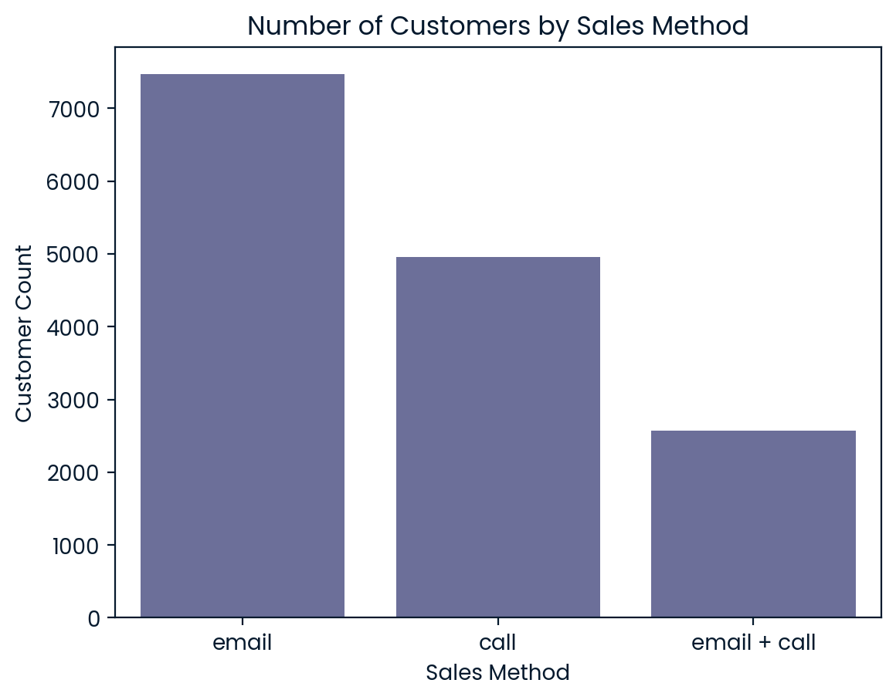
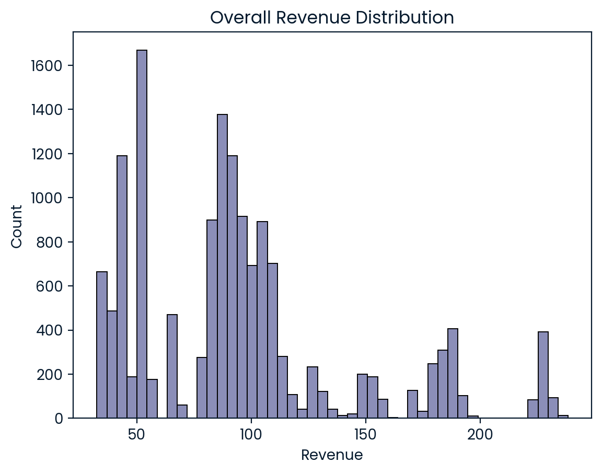
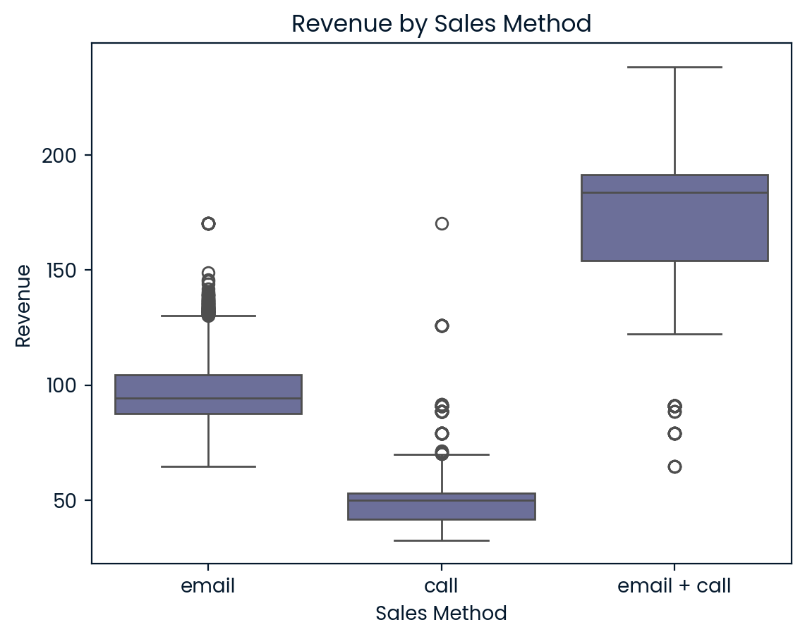
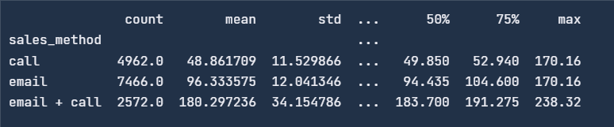
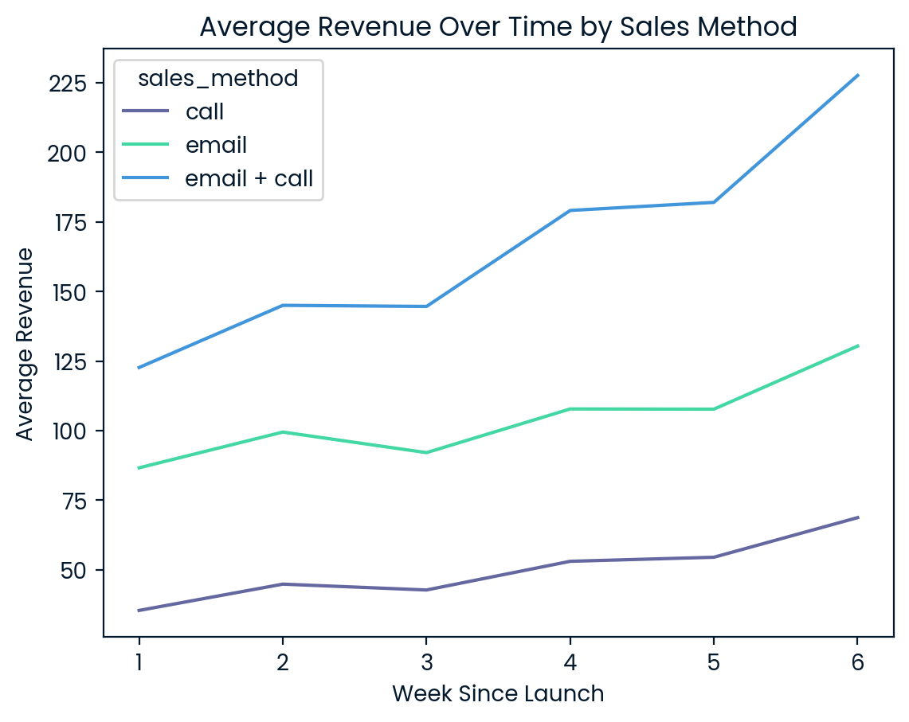

# Goal

Determine the most effective sales strategy for the new office stationery product line.

## Business Questions

1. How many customers per method?

2. What does revenue distribution look like overall and by method?

3. Revenue trends over time by method?

4. Which method is most effective, considering effort vs. revenue?

## Written Report

This report includes a summarized methodogy and analysis on sales approaches for the new product line. The goal is to determine which of the following sales strategy is the most effective for the new product line.

#### Data Validation

Looking at the contents of the dataset, we have six columns: 'week', 'sales_method', 'customer_id', 'nb_sold', 'revenue', 'years_as_customer', 'nb_site_visits', and 'state'. Before going into the analysis, we need to validate and clean the data so that it is according to the specifications given. Below are the steps undertaken for each column in the dataset:

- week

  - check for null values,
  - check if datatype is int,
  - check if range is within 0-6 weeks (product line was released in this timeframe)

- sales_method

  - check for null values,
  - check if datatype is object,
  - check for consistency of values,
  - replace values to be consistent and lower case for all values for ease ('email', 'call', 'email + call')

- customer_id

  - check for null values
  - check if datatype is object,
  - check if all values are unique

- nb_sold

  - check for null values,
  - check if datatype is int,
  - check if all values are non-negative

- revenue

  - check for null values,
  - check if datatype is float,
  - Considering that we have multiple new products and that revenue will vary depending on which products were sold, I have decided to create a dictionary by grouping the dataset by number of new products sold and then compute the mean for each group. This decision was done knowing that we have no way of knowing what products were sold so we just have to know what the average revenue is for a certain number of units sold. The computed values will then be used to replace the null values in the _revenue_ column by mapping each row to the corresponding _nb_sold_ value.

- years_as_customer

  - check for null values,
  - check if datatype is int
  - check if values are non-negative,
  - Clip the upper value to 41, considering that the company was found in 1984.

- nb_site_visits

  - check for null values,
  - check if datatype is int
  - check if values are non-negative,

- state
  - check for null values,
  - check if datatype is object,
  - check if there are inconsistent values or abbreviations (e.g. 'California', 'CA')

#### Exploratory Data Analysis

##### Business Questions

1. How many customers per method?

To explore the adoption of each sales strategy, a countplot was generated with sales_method on the x-axis and the number of customers on the y-axis.

From the visualization, it is clear that the email method was used with the largest number of customers, followed by call, and finally email + call. This likely reflects the effort required by each method, as email campaigns are more scalable.

The exact number of customers per method, using value_counts() in pandas, is shown below:

These figures confirm that the email strategy reached the broadest customer base, which is an important consideration when comparing impact against effort.

2. What does revenue distribution look like overall and by method?

To evaluate how revenue varies across all customers, a histogram of the revenue variable was plotted.

The distribution is right-skewed, indicating that while most customers generated lower revenue, a smaller number of transactions resulted in significantly higher sales. This is typical of many sales datasets, where a few high-value deals account for a disproportionate share of revenue.

To further analyze the revenue distribution, a box plot showing the distribution of revenue per sales_method was created.

The figure above shows the spread of the revenue for each sales_method. Using pandas.describe on the dataset grouped by sales method, we can further analyze the revenue distributions.

From the table, we observe the following:

- Email + Call yields the highest average revenue per customer at , with a wide spread and a maximum of \$238.32.

- Email alone generates a respectable \$96.33 on average, with a narrow distribution, indicating consistent performance.

- Call performs the lowest in terms of revenue, averaging only \$48.86 per customer.

The interquartile ranges (25\%–75\%) further confirm this trend:

- Email + Call customers consistently generate higher revenue (Q1 = \$154.17, Q3 = \$191.28).

- Email customers fall within a tighter but still strong range (Q1 = \$87.52, Q3 = \$104.60).

- Call-only customers tend to generate low revenue, with most between \$41.56 and \$52.94.

These results clearly demonstrate that combining email with a follow-up call leads to significantly higher sales per customer, albeit likely with greater effort from the sales team.

3. Revenue trends over time by method?

To answer the revenue trends over time by method, we create a lineplot with week on the x-axis and revenue on the y-axis, further grouped by sales_method. The figure below shows the average revenue over time by sales_method.

From the visualization, we can see that all three sales_method increase their revenues over time, showing that the revenue trend is similar across all methods, which is an upward trend. The email method has the highest average revenue over time, followed by call, and finally email + call.

4. Which method is most effective, considering effort vs. revenue?

Given the results found above, all three methods demonstrate positive revenue trends over time, but their efficiency in converting customer interaction into revenue varies significantly. From our analysis, email + call generates the highest average revenue per customer at \$180.30, but this approach involves both email outreach and follow-up calls, which might require some time investment and effort from the sales team. Email alone yields a solid \$96.33 average revenue, with minimal team effort, making it the most scalable and time-efficient method while also reaching the highest number of customers. Call-only performs the weakest, with only \$48.86 average revenue, despite the highest time cost (~30 minutes per customer).
From the analysis above, if the company wants to maximize revenue per customer, then the email + call method is recommended. However, if the company prioritizes broader reach while also giving importance to positive revenue generation, then the email method is recommended, offering the best balance between customer reach and revenue performance.

#### Definition of a metric for the business to monitor

To monitor the effectiveness of each sales strategy, I propose tracking the Average Revenue per Customer segmented by sales_method. This metric is easy to calculate, meaningful, and sensitive to changes in sales performance over time.

Monitor this metric over time to evaluate which strategies improve or decline in effectiveness. This measures how much revenue each approach generates per customer, and is scalable, can be updated weekly or monthly to measure improvement or decline in performance.

Using the existing data we have, we can set the baseline values for the metric:

| Sales Method | Avg Revenue per Customer |
| ------------ | ------------------------ |
| Email        | \$96.33                  |
| Call         | \$48.86                  |
| Email + Call | \$180.30                 |

In conclusion, the analysis reveals that the Email + Call method generates the highest average revenue per customer, making it the most effective strategy in terms of pure financial return. However, this approach also requires more effort from the sales team.

On the other hand, the Email-only strategy demonstrates the best balance between scalability and performance—reaching the largest number of customers with minimal effort while still producing strong and consistent revenue results.

To ensure ongoing success and adaptability, it is recommended that the business track the Average Revenue per Customer over time, segmented by sales method. This will provide a clear view of which strategies are performing best and allow for data-driven adjustments to optimize sales effectiveness moving forward.
